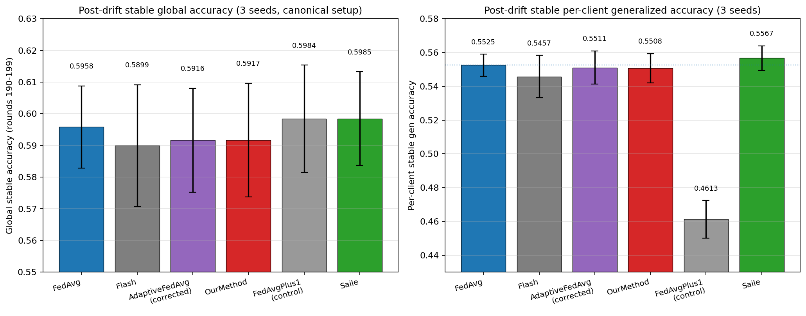
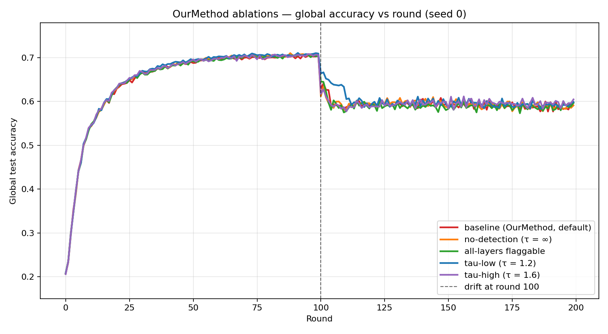
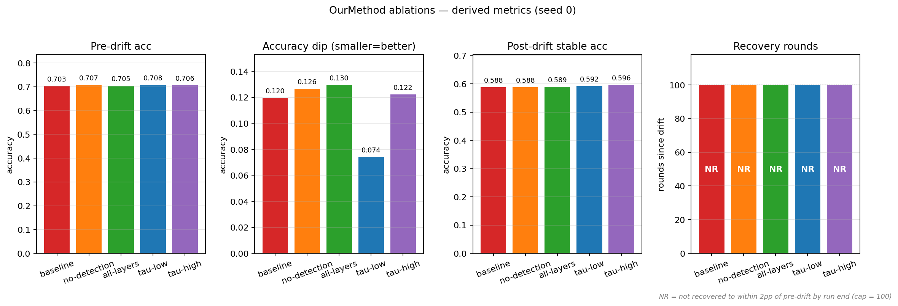
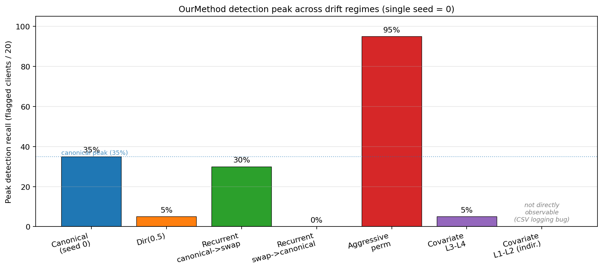
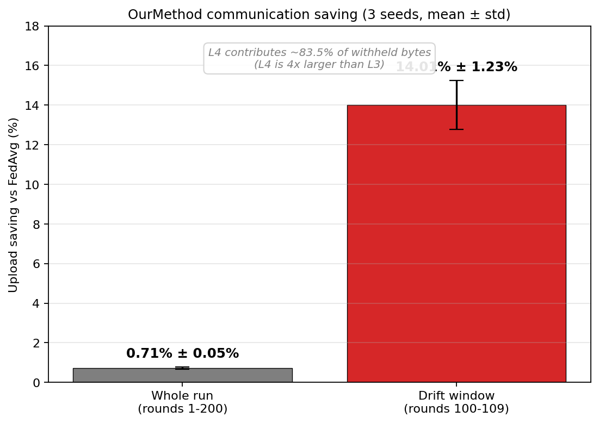

# Findings Report: Drift-Triggered Selective Layer Adaptation in Federated Learning under Distributed Real Concept Drift

**Student:** Surafel Sentayehu (MSc AI, Addis Ababa University)
**Advisor:** Dr. Adane Letta
**Scope of this report:** Part A only, the original concept-drift selective-layer-adaptation method (referred to throughout as OurMethod). The FedBN / partial-participation investigation is being continued separately and is not included here.

---

## 1. Framing

The experimental setup follows the FedCCFA (NeurIPS 2024) protocol so that the numbers can be read against a known reference point. The dataset is CIFAR-10, partitioned across 20 clients with a Dirichlet(0.1) split, which is heterogeneous enough that most clients own only two or three classes with meaningful mass. Training runs for 200 communication rounds with 5 local SGD epochs per round, batch 64, learning rate 0.01, momentum 0.9, weight decay 1e-5. The model is CifarCNN with 107,690 parameters: three convolutional blocks (L1, L2, L3), one hidden fully connected layer (L4), and a classifier head (fc). L4 alone holds 73,856 parameters, about 68.6 percent of the model. There are no normalization layers anywhere in the architecture, which is inherited from the FedCCFA reference implementation.

Concept drift in this setup is a sudden, per-cohort pairwise label swap occurring at round 100. The 20 clients are divided into three cohorts. Cohort A (6 clients) swaps labels 1 and 2 (cat and dog). Cohort B (6 clients) swaps labels 3 and 4 (deer and frog). Cohort C (8 clients) swaps labels 5 and 6 (horse and ship). Pixels are unchanged. Only the label mapping for those two classes flips in each cohort. This is real concept drift in the P(Y|X) sense, with no covariate shift in the canonical setup.

OurMethod is a clustering-free, client-side, per-layer, reversible mechanism. During local training each client computes the per-layer Frobenius norm of the weight update and divides by an EMA of that quantity (alpha 0.3, warmup 10 rounds). When the ratio exceeds tau equals 1.4 on layer 3 or layer 4, the client flags that layer. On the next round the client refuses to overwrite that layer with the global average and refuses to upload it. The classifier head and all unflagged layers are still synchronized. When the layer's update ratio falls back below threshold on a later round, sharing resumes. The design intent is that under drift the flagged clients protect their newly-adapted feature representation from being washed out by the federation average.

The two metrics that matter are global accuracy on the canonical CIFAR-10 test set (evaluated on the global model, no per-client variants), and per-client generalized accuracy following the FedCCFA protocol, which evaluates the global model against four label variants of the full test set, applies each cohort's swap to the relevant variant, and averages per client. An earlier version of the per-client evaluator ran on the locally fine-tuned model rather than the global model and inflated the metric by 2.76 percentage points. That bug is fixed in the numbers reported here. The per-client metric is validated bit-exact identical to global accuracy in the pre-drift window.

---

## 2. Main result: three seeds, single sudden drift

Six methods are compared across three seeds on the canonical setup: FedAvg, Flash, AdaptiveFedAvg in its corrected form, OurMethod, FedAvgPlus1 as a control, and Saile. The pre-drift window is rounds 89 to 99, the dip is computed against the minimum in rounds 100 to 109, and the stable window is rounds 190 to 199. The summary below reports the stable post-drift mean and standard deviation across seeds.

| Method | Global stable | Per-client stable |
|---|---:|---:|
| FedAvg | 0.5958 ± 0.0129 | 0.5525 ± 0.0065 |
| Flash | 0.5899 ± 0.0192 | 0.5457 ± 0.0125 |
| AdaptiveFedAvg (broken /cur_round) | 0.4941 ± 0.0302 | 0.4653 ± 0.0173 |
| AdaptiveFedAvg (corrected) | 0.5916 ± 0.0164 | 0.5511 ± 0.0098 |
| FedAvgPlus1 (control) | 0.5984 ± 0.0169 | 0.4613 ± 0.0111 |
| OurMethod | 0.5917 ± 0.0180 | 0.5508 ± 0.0086 |
| Saile | 0.5985 ± 0.0148 | 0.5567 ± 0.0072 |

*Post-drift stable accuracy across the six methods, with standard deviation error bars across three seeds. Left panel is global accuracy on canonical CIFAR-10 (rounds 190 to 199). Right panel is per-client generalized accuracy on the cohort-specific test variants. On global, all six methods overlap within their error bars. On per-client, FedAvg, AdaptiveFedAvg-corrected, OurMethod, and Saile cluster tightly around 0.55 (dotted line shows FedAvg's level), while FedAvgPlus1 (the local-fine-tuning control) collapses to 0.4613 because one epoch of local SGD on a Dir(0.1) shard concentrates the model on the few classes the client owns.*

The headline comparison is OurMethod minus FedAvg. On global stable, the per-seed deltas are -0.82pp, +0.30pp, and -0.73pp, with mean -0.42pp and standard deviation 0.51pp. On per-client stable, the per-seed deltas are -0.38pp, +0.12pp, and -0.27pp, with mean -0.18pp and standard deviation 0.22pp. On both metrics the magnitude of the mean delta is smaller than the standard deviation across seeds, and the sign of the delta is not consistent across seeds. By the usual reading of three-seed results this is within seed noise.

The mechanical reason this happens has to do with what a pairwise label swap actually does to the network. Only two of ten classes are remapped per cohort, and the input pixels are unchanged, so the convolutional feature extractor (L1 through L3) is essentially being asked to keep doing the same job: produce informative features for the same ten visual categories. L4 is being asked to support a mostly-unchanged class boundary, with only the readout for two of those classes flipped. The classifier head is the natural place for the swap to be absorbed, and the classifier is always synchronized in OurMethod, so its global update path is identical to FedAvg's. OurMethod's detector does fire (about 35 percent of clients on average, discussed in Section 3), and the flagged clients do keep L3 and L4 local. But because the federation average for L3 and L4 was not actually corrupted by the swap in this regime, choosing to keep them local instead of averaging them in does not produce a different final weight in any meaningful sense. The two paths arrive at similar L3 and L4 weights by similar trajectories.

The corrected AdaptiveFedAvg and Saile both come out in the same neighborhood as FedAvg, which is consistent with the reading above: at this operating point there is no large drift-adaptation lift available for a well-tuned adaptive method to capture either. Saile shows a small consistently positive direction on per-client (around +0.42pp across all three seeds, all positive in sign), which is suggestive but not defensible at n equals 3. With three seeds and a standard deviation of 0.36pp, that band straddles zero in any honest confidence interval.

Flash trails the FedAvg cluster by about half a percentage point on per-client stable. Flash is a server-side adaptive aggregation method designed for a different kind of heterogeneity, and the comparison is included for completeness rather than because it is a matched baseline.

FedAvgPlus1 is the more informative control. It runs plain FedAvg and then adds one extra local epoch on each client at evaluation time. Its per-client stable result is 0.4613 ± 0.0111, which is 9.12 percentage points below FedAvg. One extra epoch on a Dir(0.1) shard concentrates the model on the two or three classes that client owns and collapses generalization to the rest of the label space. This matters for reading the rest of the report: it rules out the easy interpretation that any per-client lift over FedAvg is just a personalization artifact from doing a little local training at the end. At Dir(0.1), trivial last-step personalization actively hurts. Any per-client lift would therefore have to come from mechanism, not from gluing one more epoch onto FedAvg.

---

## 3. Detection statistics on the canonical drift

The detector's behavior on the canonical pairwise swap is summarized below as the number of clients whose L3 or L4 flag is active in each of the ten rounds following round 100.

| Seed | flagged_count over rounds 100 to 109 | Peak |
|---|---|---:|
| 0 | 7, 7, 7, 7, 6, 1, 1, 1, 1, 1 | 7/20 (35%) |
| 1 | 6, 6, 6, 6, 5, 2, 0, 1, 1, 1 | 6/20 (30%) |
| 2 | 8, 8, 8, 8, 6, 2, 2, 0, 0, 0 | 8/20 (40%) |

The mean peak across seeds is 7.0 out of 20, or 35 percent. Across all three seeds the L4 flag count is greater than or equal to the L3 flag count at the peak round, so L4 is the dominant contributor to the saving and to the protection action.

The detector is keyed on the EMA ratio of a layer's weight-update Frobenius norm. The ratio crosses tau when local training pushes the layer's weights in a sharper-than-recent-history direction. In the Dir(0.1) partition, each client owns roughly two or three classes with meaningful sample mass. The cohort label swap affects exactly two of the ten classes. A client's update ratio therefore spikes most when the two swapped classes happen to be classes it owns and is training on, because the gradient is concentrated on the output-related directions tied to those classes and back-propagated into the upper layers. Clients whose owned classes mostly do not overlap with the swapped pair still drift in the formal sense (their cohort assignment changed), but their local gradient signal at round 100 is dominated by classes whose mapping did not change, so their layer-update ratio does not exceed tau.

This is why 35 percent is the natural ceiling on this regime rather than a knob that more tuning could move. It is the fraction of clients for whom the cohort swap concentrates enough on their owned classes to produce a relative spike past 1.4 times their own recent variance. Two later experiments make this point clearer. Dir(0.5) reduces detection to 5 percent because shards are more balanced and the relative spike is diluted. Aggressive full per-cohort permutations push detection to 95 percent because every client's owned classes are affected by the permutation. Recall is determined by data distribution and drift severity, not by the threshold tuning.

A note on precision. The flagged_count CSV does not log per-flag correctness, and the operational ground truth is that every client in every cohort is technically drifted (every cohort gets a swap). Under that definition precision is trivially 100 percent, which is a definitional artifact rather than a measured property. The honest claim is the narrower one: the detector fires at drift events and is silent in stable windows.

---

## 4. Ablation (single seed, seed 0, global accuracy only)

Five variants of OurMethod were run on seed 0 to isolate the effect of individual design choices. Per-client generalized accuracy is not present in these CSVs because the metric was ported into the harness after the ablation runs were committed.

| Variant | Pre-drift global | Drift dip (global) | Stable global | Δ stable vs baseline |
|---|---:|---:|---:|---:|
| baseline (tau=1.4, L3/L4) | 0.7026 | 0.1196 | 0.5884 | 0 (ref) |
| no-detection (tau=∞) | 0.7071 | 0.1265 | 0.5876 | -0.08pp |
| all-layers flaggable | 0.7047 | 0.1296 | 0.5894 | +0.10pp |
| tau-low (tau=1.2) | 0.7077 | 0.0740 | 0.5924 | +0.40pp |
| tau-high (tau=1.6) | 0.7057 | 0.1223 | 0.5965 | +0.81pp |

*Round-by-round global accuracy curves for the five ablation variants across the full 200-round run. The tau-low curve (blue, tau=1.2) sits visibly above the others during the drift dip window around round 100, which is the source of its 4.56pp smaller dip versus baseline.*

*Four-panel bar comparison across the five ablation variants: pre-drift accuracy, drift dip depth, post-drift stable accuracy, and recovery rounds. The dip panel makes the tau-low effect visually clearest.*

The standout in this table is tau-low. Reducing the detector threshold from 1.4 to 1.2 reduces the drift dip from 0.1196 to 0.0740, a 4.56 percentage point softer dip. Stable accuracy is unchanged within the noise level of a single seed (0.5924 vs 0.5884). The mechanical explanation is that a more sensitive detector fires on more clients and fires earlier in the drift window. Those clients then refuse to overwrite their L3 and L4 with the global average on the rounds immediately after drift, when the global average is being pulled around by the drifted cohorts' uploaded gradients. The dip is shallower because more clients are insulated, in their local copy, from the most disturbed rounds of the global aggregation. By the time the federation stabilizes, the local and global trajectories converge and stable accuracy looks the same.

The other variants do not produce clear functional effects at n equals 1. tau-high looks like a +0.81pp lift on stable, but the no-detection variant lands at -0.08pp and the all-layers variant lands at +0.10pp, both within any reasonable single-seed noise band on a number that swings 0.5 to 1.5pp across seeds in the main study. So the only design knob with a clearly attributable mechanical effect in the ablation is tau, and its effect is on the transient dip rather than on stable accuracy.

---

## 5. Cross-test exploration (single-seed diagnostics)

Five additional regimes were explored on a single seed each to characterize where the mechanism engages and where it does not. These are diagnostic in nature rather than evidence for the headline claim.

**Dir(0.5).** A more balanced partition replaces Dir(0.1) and the canonical pairwise swap is kept. OurMethod minus FedAvg on per-client stable is +0.06pp. Detection peak collapses from 7 out of 20 in the canonical setup to 1 out of 20 (5 percent). Mechanically, when each client's shard contains substantial mass across most of the ten classes, the swap of two classes produces a much smaller relative shift in the gradient direction for any single client, because the gradient from the unaffected eight classes dominates. The relative spike past tau does not happen, the detector does not fire, and the mechanism is dormant. OurMethod behaves like FedAvg by default.

**Recurrent alternating drift.** The drift event at round 100 is followed by a swap-back event at round 150 and the cycle repeats. The detector fires 6 out of 20 (30 percent) on the canonical-to-swapped transitions and 0 out of 20 (0 percent) on the swap-back transitions. The reason is in the EMA. After the first transition the recent variance in each affected layer's update magnitude is elevated for several rounds. When the swap-back arrives, the absolute spike is similar to the first event, but the divisor (the EMA running average) is now larger, so the ratio does not exceed tau. The detector is structurally asymmetric on alternating drift. On stable per-client accuracy the OurMethod-minus-FedAvg delta is +0.27pp at this seed, consistent with the canonical reading: detection at the first event engages the mechanism, the mechanism modestly affects the dip, and the stable window settles in the same neighborhood as FedAvg.

**Aggressive concept drift via per-cohort full permutations.** Each cohort receives a different full permutation of the ten labels at round 100 instead of a pairwise swap. Detection saturates at 19 out of 20 (95 percent) because every cohort's data is now maximally disrupted in the gradient sense, and the layer-update ratio exceeds tau for almost every client. The accuracy delta for OurMethod minus FedAvg on per-client stable is 0.00pp, identical to four decimal places. This is informative. It establishes that detection mass alone, even at 95 percent recall, does not produce a stable-accuracy advantage. The pre-drift L3 and L4 weights were trained against the old 10-class mapping, and under a full per-cohort permutation those weights are no longer useful for any cohort's new task. Whether the client keeps those weights local or accepts the federation average, the starting point for the post-drift adaptation is similarly far from the new optimum, and the two trajectories converge to similar stable accuracy.

**Covariate drift with the default L3-L4 detector.** Labels are unchanged and the input pixels are corrupted with Gaussian noise injected at round 100. Detection peak is 1 out of 20 (5 percent). OurMethod minus FedAvg on per-client stable is +0.02pp. Covariate shift, by surgical-fine-tuning theory, disturbs early layers because the feature extractor must now process a different input distribution. L3 and L4 are insulated from this disturbance, so the layer-update ratio on L3 and L4 does not spike, and the detector remains silent. The mechanism is dormant.

**Covariate drift with the detector re-aimed to L1-L2.** The same covariate shift, but the watched layers are switched from L3-L4 to L1-L2. The flagged_count CSV column is hard-coded to L3 and L4 and reads 0 in this run, so detection recall is not directly observable. Indirect evidence is available through trajectory divergence: the L1 and L2 weight updates diverge from the FedAvg reference by 3 to 10 times the silent-baseline range, which is consistent with the detector firing and keeping those layers local. The accuracy result is that OurMethod minus FedAvg on per-client stable is -0.12pp and the immediate drift dip is 2.82pp worse than the L3-L4 default. The mechanical reason this gets worse rather than better is that early-layer features benefit specifically from being exposed to many client distributions during federation averaging. A client whose input was corrupted with one realization of noise produces early-layer weights tuned to that specific noise. Keeping those weights local cuts the federation off from that signal, which would otherwise be aggregated with the other clients' noise realizations to produce a more robust shared feature extractor. The client itself is then left with a hybrid model whose locally-kept L1 and L2 do not match the globally-averaged L3, L4, and fc that it consumes.

*Peak OurMethod detection recall (flagged clients out of 20) across the canonical setup and the five additional regimes. The dotted line marks the canonical 35 percent reference. Recall tracks how concentrated the drift signal is per client: aggressive per-cohort permutations saturate the detector at 95 percent, the canonical pairwise swap sits at 35 percent, more-balanced Dir(0.5) and covariate-on-default-layers collapse to 5 percent, and the recurrent swap-back is structurally silent at 0 percent. The covariate-with-L1-L2 re-aim bar is hatched and labeled "not directly observable" because the flagged_count CSV column is hard-coded to L3 and L4 and reads 0 in that run despite indirect trajectory evidence that the mechanism is firing.*

---

## 6. Communication analysis

OurMethod's upload behavior is asymmetric. The client only ever withholds layers from the upload (when flagged), so the per-round upload volume is at most equal to FedAvg's. FedAvg uploads 107,690 parameters per client per round, which totals 2,153,800 parameters per round across the 20 clients, for a whole-run total of 430.76 million parameters across 200 rounds.

| Window | Saving vs FedAvg (mean ± std, 3 seeds) |
|---|---:|
| Whole run (rounds 1 to 200) | 0.710% ± 0.054% |
| Drift window (rounds 100 to 109) | 14.006% ± 1.233% |

*OurMethod communication saving versus FedAvg, averaged over three seeds. The whole-run saving (left bar, 0.71 percent ± 0.05 percent) is small because the mechanism is dormant outside the drift window. The drift-window saving (right bar, 14.01 percent ± 1.23 percent) is the figure that represents what the mechanism does in the rounds where it actually engages. L4 contributes about 83.5 percent of the withheld bytes because L4 has roughly four times the parameter count of L3.*

The 0.71 percent whole-run figure is small because the mechanism is dormant for roughly 190 of the 200 rounds. The 14 percent drift-window figure is the more representative number for what the mechanism does when it engages. The saving would scale with drift frequency in deployment scenarios where drift events recur often. L4 contributes about 83.5 percent of the saving across all measurements because L4 has roughly four times the parameter count of L3 (73,856 versus 18,496), so each L4 withholding is worth about four L3 withholdings in bytes. The saving is a real but secondary property of the mechanism rather than a headline claim.

---

## 7. Baseline implementation notes

Three of the baselines required implementation work or fixes that are worth recording because they affect how the numbers in Section 2 should be read.

**AdaptiveFedAvg.** The reference port from the FedCCFA repository contains a learning-rate update of the form `lr = lr_base / cur_round` inside the per-round adaptive step. With cur_round growing through training, this divisor pushes the effective LR toward the order of 1e-4 by the time drift arrives at round 100, which suppresses the very adaptivity the method is designed to provide. Saile's independent re-implementation of the same Canonaco 2021 algorithm omits the divisor, which is what initially flagged this as a likely porting deviation rather than a faithful reproduction. The original Canonaco paper is paywalled, so the fix is justified inferentially rather than by direct comparison to the original. With the divisor removed and bias correction retained, AdaptiveFedAvg's stable global accuracy lifts from 0.4941 ± 0.0302 to 0.5916 ± 0.0164 across three seeds, a +9.75pp lift, with all three seeds positive. On per-client stable the lift is +8.58pp. The corrected version is the one used in the main comparison in Section 2.

**Saile (FLTA 2024).** Saile's reference setup uses learning rate 0.2 with a 0.99 per-round decay. In this setup (CifarCNN, Dir(0.1), batch 64, 5 local epochs) lr=0.2 diverges within the first few rounds and lr=0.1 also diverges. A small LR sweep run under the same protocol used for AdaptiveFedAvg selected lr=0.01, which is the value used in the main comparison. The Saile mechanism itself (per-client loss-EMA dynamic LR) is verified operational: per-client LRs span a 3.4 times range, rise by 28 percent at the drift event, and the LR cap binds on 178 of 200 rounds, indicating the dynamic adjustment is active throughout.

**FedAvgPlus1 (control).** Plain FedAvg followed by one additional local epoch on each client at evaluation time. Its purpose in the report is to bound the easy-personalization story at this operating point. Its per-client stable result of 0.4613 ± 0.0111 (9.12pp below FedAvg) establishes that one epoch of trivial local fine-tuning on a Dir(0.1) shard collapses generalization rather than helping it, so a per-client lift over FedAvg in any other method must come from mechanism rather than from incidental local training.

---

## 8. Why OurMethod and FedAvg come out tied across the tests

The detector part of OurMethod works as designed. In every regime tested where drift is concentrated enough to produce a relative weight-update spike past tau, the detector fires. The question this section addresses is why the detection does not translate into a stable-accuracy advantage over FedAvg in any of the five regimes that were run.

OurMethod's value depends on a joint condition that has three parts. First, the drift has to be concentrated enough per client that the detector fires (otherwise the mechanism is dormant and the comparison reduces to FedAvg-vs-FedAvg). Second, the drift has to damage the layers the detector is watching (otherwise there is nothing in those layers worth protecting). Third, the pre-drift weights of the protected layers have to remain task-relevant after drift, and the post-drift refinement of those weights has to benefit from being kept local rather than being averaged across the federation (otherwise the protection action is neutral or harmful). Each of the five regimes tested violates at least one of these three conditions.

In the canonical pairwise label swap, the first condition is partially satisfied at 35 percent detection, but the second and third are weak. Only two of ten classes are remapped per cohort and the input pixels are unchanged, so L3 and L4 do not have to change much to support the new mapping, and the classifier head (which is always synchronized) absorbs most of the remap. The federation average of L3 and L4 across the post-drift rounds is similarly close to what the client needs as the kept-local copy is, so the choice between keeping and averaging makes little difference to where stable accuracy settles.

In the aggressive per-cohort permutation regime, the first condition is fully satisfied at 95 percent detection. But the second condition flips. The pre-drift L3 and L4 weights are no longer useful for any cohort's new task because every cohort has a different ten-class permutation, so the kept-local weights and the federation-averaged weights are both similarly far from useful. Both trajectories then have to relearn the upper layers from a similarly poor starting point, and they converge to similar stable accuracy.

In the Dir(0.5) regime the first condition fails outright. The disturbance per client is too diluted across many classes for the relative update spike to exceed tau, so the detector fires on only 1 out of 20 clients (5 percent) and the mechanism is dormant for most of the run. OurMethod behaves like FedAvg by default.

In the recurrent alternating drift regime the first condition is satisfied on the canonical-to-swapped events (6 out of 20, 30 percent) but is structurally violated on the swap-back events (0 out of 20). The EMA's recent variance is elevated from the prior transition, so the absolute spike on the second event is divided by a larger running average and does not exceed tau. The mechanism only engages on half of the events.

In the covariate drift regime with the default L3-L4 detector, the first condition fails because covariate shift disturbs early layers rather than upper layers, and detection is 5 percent. With the detector re-aimed to L1-L2 the first condition is satisfied (the trajectory evidence is consistent with the detector firing), but the third condition fails: early-layer features benefit specifically from being exposed to the federation's averaged view across many client distributions, so keeping a single client's noise-adapted L1 and L2 local removes that client from the signal that would have built a more robust shared feature extractor, and the dip becomes 2.82pp worse on per-client.

The pattern across the five regimes is that the regimes which produce concentrated, detectable drift either do not damage the protected layers (canonical swap) or damage them in a way that the pre-drift weights cannot mitigate (aggressive permutation), while the regimes that could benefit from layer protection either do not produce concentrated enough drift for the detector (Dir(0.5), covariate L3-L4) or produce it in layers where withholding is mismatched to how those layers learn (covariate L1-L2). The joint condition required for OurMethod to produce a stable-accuracy gap over FedAvg, which is concentrated detectable drift in layers whose pre-drift weights remain task-relevant after drift and whose updates benefit from being kept local, is not jointly satisfied in any of the five regimes that were run.
